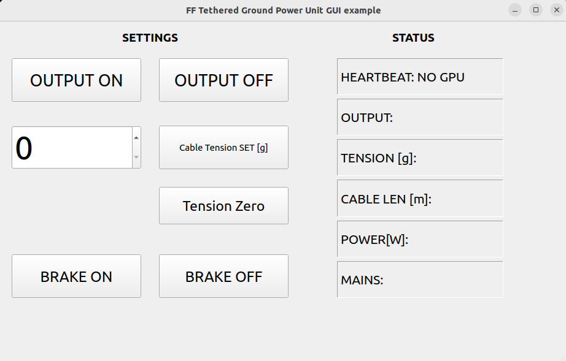

# FF-Tether Ground Power Unit GUI example

[](https://opensource.org/licenses/BSD-3-Clause)

<hr>

Simple PyQt5 GUI that demonstrates UDP over Ethernet data exchange between Flyfocus Tethered Ground Power Supply and a PC. It supports all possible data frames used by the standard GPU.



<br>

# Using the code #
You can modify the code and GUI structure yourself or use one of the provided executable files from "Releases" section.

In order to modify the GUI structure use [QT DEsigner](https://doc.qt.io/qt-6/qtdesigner-manual.html))

After editing the ".ui" file you will have to regenerate the GUI code by calling the following line from your project folder: 

```
pyuic5 -x FF_GPU_control_gui_example.ui -o FF_GPU_control_gui_example.py
```


# Note #
It's just a simple example - do not trust your life with it. Always wear safety equipment when working with high voltages!
